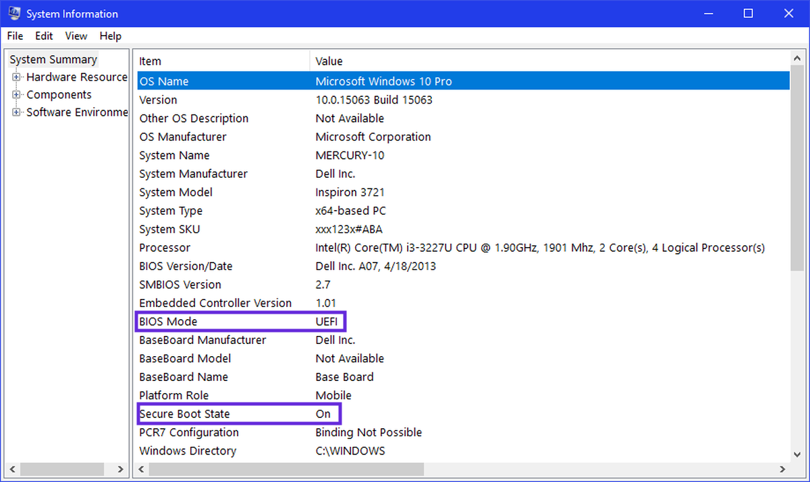

# Install Notes for Dual Booting

	George Koffas | Oct 8 2021

---

## ---- STEP 1: Windows & BIOS Investigation ----

Before creating partitions for Linux, we need to look out for some things in Windows.

The most problematic ones are:

> - **BitLocker**-enabled disks
> - **MBR** vs **GPT**-partitioned disks
> - **FastStartup** | this can be disabled from inside the Windows environment

In the BIOS, we need to check out for:

> - **SecureBoot**
> - **UEFI** vs **Legacy** Boot Mode | this is basically the same as the *MBR* vs *GPT* problem

For each of those, we have a solution:

### BitLocker
> #### Using PowerShell
>
 ```bash
$BLV = Get-BitLockerVolume
Disable-Bitlocker -MountPoint $BLV
```

> #### Using CMD:
>
```bash
manage-bde -off <drive letter>:
```
---

### MBR vs GPT 
> Run *System Information* and check the BIOS setting 

**OR**

> #### Using CMD:
>
```bash
diskpart
list disk
```
> and check whether the Gpt option has an asterisk (\*) 
---

### FastBoot
> [3] : Disable FastStartup
> 
> [4] : Disable SecureBoot
>
> [5] : Same as *[2]* 

---

## ---- STEP 2: Create Linux Partition for Linux ----

