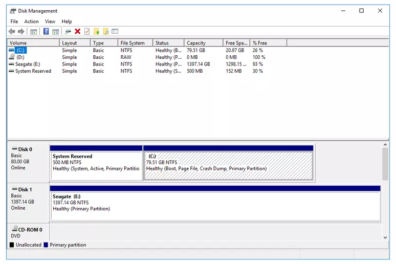

# Install Notes for Dual Booting

	George Koffas | Oct 8 2021

---

## ---- STEP 1: Windows & BIOS Investigation ----

Before creating partitions for Linux, we need to look out for some things in Windows.

The most problematic ones are:

> - **BitLocker**-enabled disks
> - **MBR** vs **GPT**-partitioned disks
> - **FastStartup** | this can be disabled from inside the Windows environment

In the BIOS, we need to check out for:

> - **SecureBoot**
> - **UEFI** vs **Legacy** Boot Mode | this is basically the same as the *MBR* vs *GPT* problem

For each of those, we have a solution:

### BitLocker
> #### Using PowerShell
>
 ```bash
$BLV = Get-BitLockerVolume
Disable-Bitlocker -MountPoint $BLV
```

> #### Using CMD:
>
```bash
manage-bde -off <drive letter>:
```
---

### <a name="mbr-gpt"></a>MBR vs GPT 
> Run *System Information* and check the BIOS setting 

**OR**

> #### Using CMD:
>
```bash
diskpart
list disk
```
> and check whether the Gpt option has an asterisk (\*) 

---

### FastBoot
> #### Using CMD:
```bash
powercfg -h off
```
> to disable FastBoot

---
 
### SecureBoot
> Enter the BIOS settings of the host machine, and go to Boot Options. From there, disable SecureBoot.
> #### **NOTE**: while some BIOS have it enabled, in case your BIOS doesn't, **ALWAYS** enable Virtualization. This option can be also found in Boot Options.
> After setting these, press F10 to Save and Exit.

---

### UEFI vs Legacy (CSM)
> Refer to [MBR vs GPT](#mbr-gpt). Having an UEFI BIOS means the disk is partitioned in GPT format, while having a Legacy BIOS means the disk is most likely partitioned in MBR format.

> For further reading, [this article](https://help.ubuntu.com/community/UEFI) summarizes everything you need to know.

**IMPORTANT** : If your disk is GPT partitioned, but it already has an EFI partition, **DO NOT CREATE A NEW ONE** on the next step. Only create one if the disk has no other installations (see [Appendix](#appendix)).

---

## ---- STEP 2: Create Linux Partition for the distribution ----

1. Open the Disk Management tool 

2. Right-click on the volume to partition, then select "Shrink Volume"

3. On the prompt that pops up, select *at least* **20 GB + sizeof(RAM)** to reserve for the new partition (this includes space for the root and swap partitions).

4. If it is not possible to reserve at least this much, there are some things to try before giving up and going for a VM installation (see [Appendix](#appendix)). If all else fails, do not follow the following steps and proceed with a VM installation.

5. After reserving a partition for Linux, insert your Bootable USB stick and reboot the system.

6. Enter BIOS. The button that does so differs between manufacturers, but it is always one of
	- F9
	- F10
	- F11
	- F12
	- F2

7. On the Boot Options menu, change the Boot Order to start with the inserted USB stick, then hit F10 to Save and Exit.

---

##  ---- STEP 3: Install the distribution ----   

1. Follow the instructions of the distribution. Always remember to connect to an available network to download proprietary drivers.

2. When you get to the installation way, select "Something Else" (in Ubuntu) or Manual.

3. If you're installing Linux in the same disk as Windows:
	- Select the free space and create the necessary partitions: **\/** (root), **swap**, and (optionally) **\/home**.
	- **swap** needs to be at least the size of the system's RAM.
	- **\/** needs to be at least 20GB.
	- If you don't create a separate partition for */home*, you can use all the remaning space for the root partition. Otherwise, use it for /home.
	- If the disk has an MBR partition scheme, selecting "Logical" instead of "Primary" partition type is recommended. IF the disk has GPT partition, it generally doesn't matter.

4. And you're done! Now you can lay back or start another install.

---

## ---- STEP 4: Post-Installation ----  


