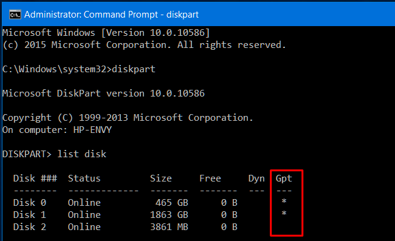

# Install Notes for Dual Booting

	George Koffas | Oct 8 2021

---

## ---- STEP 1: Windows & BIOS Investigation ----

Before creating partitions for Linux, we need to look out for some things in Windows.

The most problematic ones are:

> - **BitLocker**-enabled disks
> - **MBR** vs **GPT**-partitioned disks
> - **FastStartup** | this can be disabled from inside the Windows environment

In the BIOS, we need to check out for:

> - **SecureBoot**
> - **UEFI** vs **Legacy** Boot Mode | this is basically the same as the *MBR* vs *GPT* problem

For each of those, we have a solution:

### BitLocker
> #### Using PowerShell
>
 ```bash
$BLV = Get-BitLockerVolume
Disable-Bitlocker -MountPoint $BLV
```

> #### Using CMD:
>
```bash
manage-bde -off <drive letter>:
```
---

### MBR vs GPT (#mbr-gpt) 
> Run *System Information* and check the BIOS setting 

**OR**

> #### Using CMD:
>
```bash
diskpart
list disk
```
> and check whether the Gpt option has an asterisk (\*) 

---

### FastBoot
> #### Using CMD:
```bash
powercfg -h off
```
> to disable FastBoot

---
 
### SecureBoot
> Enter the BIOS settings of the host machine, and go to Boot Options. From there, disable SecureBoot.
> #### **NOTE**: while some BIOS have it enabled, in case your BIOS doesn't, **ALWAYS** enable Virtualization. This option can be also found in Boot Options.
> After setting these, press F10 to Save and Exit.

---

> ### UEFI vs Legacy (CSM)
> Refer to [MBR vs GPT](#mbr-gpt). Having an UEFI BIOS means the disk is partitioned in GPT format, while having a Legacy BIOS means the disk is most likely partitioned in MBR format.
> For further reading, [this article](https://help.ubuntu.com/community/UEFI) summarizes everything you need to know.

---

## ---- STEP 2: Create Linux Partition for Linux ----


